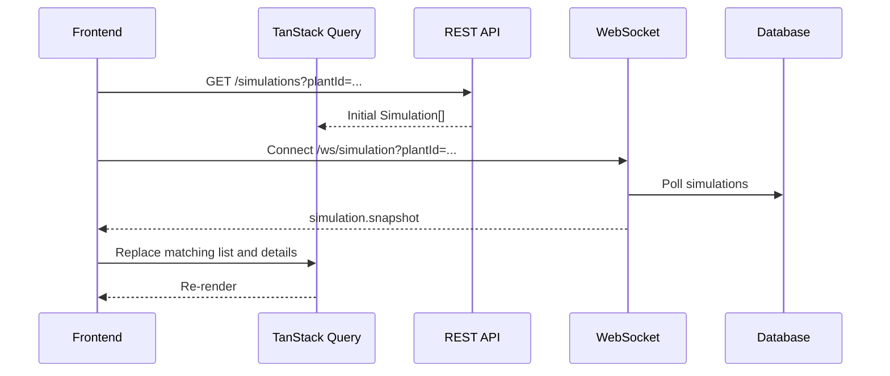
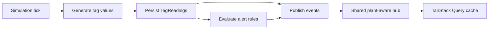

# Simulator WebSocket Pipeline

## Purpose

Use this document as implementation context for synchronizing simulator state between the Go server and React frontend.

## Current Server Behavior

```text
GET /api/v1/ws/simulation
server/internal/websockets/
```

The authenticated socket polls persisted plant state and emits two snapshots immediately and at each `intervalMs`:

- `simulation.snapshot`: simulation metadata.
- `simulation.telemetry.snapshot`: device states, latest tag readings, and unresolved alerts.

`plantId` is required and checked against the authenticated user's plant access. `status` is optional; `intervalMs` accepts `250`–`10000` and defaults to `1000`.

```ts
type SimulationStreamMessage =
  | { type: "simulation.snapshot"; data?: Simulation[]; error?: string; sentAt: string }
  | {
      type: "simulation.telemetry.snapshot";
      data?: { plantId: string; devices: DeviceState[]; readings: TagReading[]; alerts: Alert[] };
      error?: string;
      sentAt: string;
    };
```

When `error` exists, preserve the last valid cache.

## Current Flow



Start, pause, stop, and scenario commands remain REST operations:

```text
POST /simulations/:simulationId/start
POST /simulations/:simulationId/pause
POST /simulations/:simulationId/stop
POST /simulations/:simulationId/scenarios/:scenarioId/trigger
```

Update the cache from each REST response immediately. The next socket snapshot reconciles server state.

## Frontend Implementation

Suggested files:

```text
client/src/features/simulations/websocketTypes.ts
client/src/features/simulations/createSimulationSocketUrl.ts
client/src/features/simulations/useSimulationStream.ts
```

Enable WebSocket proxying in `client/vite.config.ts`:

```ts
"/api": {
  target: "http://localhost:8080",
  changeOrigin: true,
  ws: true,
}
```

Build a same-origin URL inside a client-only effect:

```ts
const protocol = window.location.protocol === "https:" ? "wss:" : "ws:";
const url = new URL(
  "/api/v1/ws/simulation",
  `${protocol}//${window.location.host}`,
);
```

`useSimulationStream` must:

- Open one socket for the selected plant.
- Validate messages and ignore unknown event types.
- Replace only the TanStack Query list matching the socket filters.
- Update `simulationQueryKeys.detail(id)` for every snapshot item.
- Preserve cached data on envelope errors.
- Recreate the socket when filters change and close it on unmount.
- Reconnect unexpected closures with exponential backoff capped at 30 seconds.
- Expose `connecting`, `open`, `reconnecting`, `closed`, or `error` state.

```ts
queryClient.setQueryData(
  simulationQueryKeys.list({ plantId, status }),
  message.data,
);
```

Treat the stream as stale after `max(intervalMs * 3, 5000 ms)` without a valid message. Keep the last data visible while reconnecting.

## Authentication

The route uses `JWTAuthMiddleware()`. Browser clients authenticate with the same-origin HttpOnly cookie used by REST; do not put long-lived tokens in the URL. Production still requires `wss://`, an origin policy, and proxy support for WebSocket upgrades.

## Remaining Live Telemetry

Snapshots now expose persisted telemetry, but the server still has no simulation tick that creates `TagReadings` and no shared publisher for incremental events.



Required server work:

1. Create one shared hub or publisher during bootstrap.
2. Inject a publisher into simulation, reading, device, and alert services.
3. Add plant-scoped subscriptions.
4. Generate and persist readings while a simulation is `RUNNING`.
5. Evaluate alerts after persistence and publish only successful changes.
6. Add event IDs or sequence numbers for deduplication.
7. Recover through REST snapshots after reconnecting.

Proposed events:

```text
simulation.snapshot
simulation.telemetry.snapshot
simulation.started
simulation.paused
simulation.stopped
tag.reading.updated
device.status.changed
alert.triggered
alert.acknowledged
alert.resolved
```

REST and the database remain the source of truth. WebSockets deliver changes.

## Implementation Order

1. Add the proxy, message types, URL builder, and `useSimulationStream`.
2. Synchronize simulation list/detail caches and display connection state.
3. Add the server simulation tick and reading persistence.
4. Add the shared publisher, plant subscriptions, and telemetry events.
5. Update reading, alert, health, and process-overview caches from events.
6. Resynchronize through REST after reconnecting.

## Completion Checks

- Only one socket exists for the selected plant.
- The first snapshot renders immediately.
- REST commands update the UI before the next snapshot.
- Errors do not erase cached data.
- Plant changes close the previous socket.
- Unexpected closure reconnects with bounded backoff.
- Production uses authenticated `wss://` connections.
- Users cannot subscribe to inaccessible plants.

