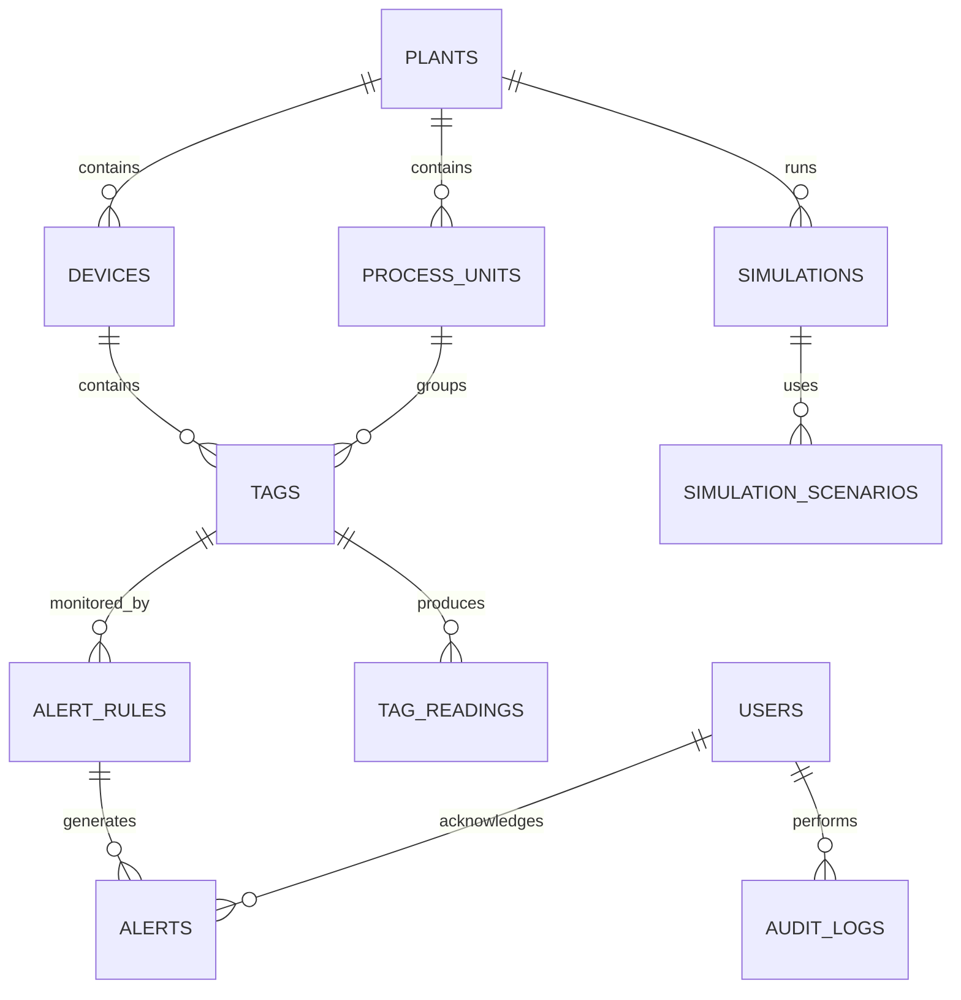

# Database Schema

This document outlines the initial relational database structure for the PLC Monitoring and Alert Simulation App.

The schema assumes PostgreSQL and uses UUIDs for primary identifiers.

Authentication uses stateless JWT access tokens. The backend validates the token on protected routes, and no database session table is required for the initial version.

## Relationship Diagram



## Core Relationships

```text
Plant
├── Process Units
│   └── Tags
│       ├── Tag Readings
│       └── Alert Rules
│           └── Alerts
├── Devices
│   └── Tags
└── Simulations
    └── Simulation Scenarios

User
├── Acknowledged Alerts
└── Audit Logs
```

In this structure, `process_units` represent physical or process areas inside a plant, such as an influent tank, acid reactor, methane reactor, gas storage, or effluent tank. `devices` represent PLCs, simulated controllers, gateways, sensor groups, or actuator groups that expose tags.

---

## `users`

Stores application users and their assigned roles.

| Field | Type | Constraints |
| ----- | ---- | ----------- |
| `id` | `UUID` | Primary key |
| `username` | `VARCHAR(100)` | Not null |
| `email` | `VARCHAR(255)` | Not null, unique |
| `password_hash` | `TEXT` | Not null |
| `role` | `VARCHAR(20)` | Not null, default `VIEWER` |
| `language` | `VARCHAR(10)` | Not null, default `EN` |
| `created_at` | `TIMESTAMPTZ` | Not null |
| `updated_at` | `TIMESTAMPTZ` | Not null |

Allowed roles:

```text
ADMIN
OPERATOR
VIEWER
```

Allowed languages:

```text
EN
ZH-TW
```

---

## `plants`

Stores monitored plants or facilities.

| Field | Type | Constraints |
| ----- | ---- | ----------- |
| `id` | `UUID` | Primary key |
| `name` | `VARCHAR(120)` | Not null |
| `location` | `VARCHAR(200)` | Nullable |
| `description` | `TEXT` | Nullable |
| `status` | `VARCHAR(20)` | Not null, default `ACTIVE` |
| `created_at` | `TIMESTAMPTZ` | Not null |
| `updated_at` | `TIMESTAMPTZ` | Not null |

Allowed statuses:

```text
ACTIVE
INACTIVE
MAINTENANCE
```

---

## `process_units`

Stores major process areas inside a plant.

For an anaerobic digestion plant, examples include influent tank, acid reactor, methane reactor, gas storage, effluent tank, and pump station.

| Field | Type | Constraints |
| ----- | ---- | ----------- |
| `id` | `UUID` | Primary key |
| `plant_id` | `UUID` | Foreign key -> `plants.id` |
| `name` | `VARCHAR(120)` | Not null |
| `type` | `VARCHAR(40)` | Not null |
| `description` | `TEXT` | Nullable |
| `status` | `VARCHAR(20)` | Not null, default `ACTIVE` |
| `created_at` | `TIMESTAMPTZ` | Not null |
| `updated_at` | `TIMESTAMPTZ` | Not null |

Allowed process unit types:

```text
INFLUENT_TANK
ACID_REACTOR
METHANE_REACTOR
GAS_STORAGE
EFFLUENT_TANK
PUMP_STATION
OTHER
```

Allowed statuses:

```text
ACTIVE
INACTIVE
MAINTENANCE
```

Recommended unique constraint:

```text
UNIQUE(plant_id, name)
```

---

## `devices`

Stores PLCs, simulated controllers, communication gateways, sensor groups, and actuator groups.

| Field | Type | Constraints |
| ----- | ---- | ----------- |
| `id` | `UUID` | Primary key |
| `plant_id` | `UUID` | Foreign key -> `plants.id` |
| `name` | `VARCHAR(120)` | Not null |
| `type` | `VARCHAR(30)` | Not null |
| `description` | `TEXT` | Nullable |
| `protocol` | `VARCHAR(20)` | Not null |
| `host` | `VARCHAR(100)` | Nullable |
| `port` | `INTEGER` | Nullable |
| `connection_status` | `VARCHAR(20)` | Not null, default `DISCONNECTED` |
| `enabled` | `BOOLEAN` | Not null, default `TRUE` |
| `last_connected_at` | `TIMESTAMPTZ` | Nullable |
| `created_at` | `TIMESTAMPTZ` | Not null |
| `updated_at` | `TIMESTAMPTZ` | Not null |

Allowed device types:

```text
PLC
SIMULATOR
GATEWAY
SENSOR_GROUP
ACTUATOR_GROUP
```

Allowed protocols:

```text
SIMULATOR
MODBUS_TCP
OPC_UA
```

Allowed connection statuses:

```text
CONNECTED
DISCONNECTED
CONNECTING
ERROR
```

Recommended unique constraint:

```text
UNIQUE(plant_id, name)
```

---

## `tags`

Stores PLC tag definitions, sensor variables, actuator states, and simulated process values.

| Field | Type | Constraints |
| ----- | ---- | ----------- |
| `id` | `UUID` | Primary key |
| `device_id` | `UUID` | Foreign key -> `devices.id` |
| `process_unit_id` | `UUID` | Foreign key -> `process_units.id`, nullable |
| `name` | `VARCHAR(120)` | Not null |
| `address` | `VARCHAR(120)` | Nullable |
| `data_type` | `VARCHAR(20)` | Not null |
| `unit` | `VARCHAR(30)` | Nullable |
| `description` | `TEXT` | Nullable |
| `read_only` | `BOOLEAN` | Not null, default `TRUE` |
| `scan_interval_ms` | `INTEGER` | Not null, default `1000` |
| `min_value` | `NUMERIC(16,4)` | Nullable |
| `max_value` | `NUMERIC(16,4)` | Nullable |
| `enabled` | `BOOLEAN` | Not null, default `TRUE` |
| `created_at` | `TIMESTAMPTZ` | Not null |
| `updated_at` | `TIMESTAMPTZ` | Not null |

Allowed data types:

```text
BOOL
INT
FLOAT
STRING
```

Recommended unique constraint:

```text
UNIQUE(device_id, name)
```

Example AD digestion tags:

| Tag | Unit | Data Type | Process Unit |
| --- | ---- | --------- | ------------ |
| `Acid_Tank_pH` | `pH` | `FLOAT` | Acid Reactor |
| `Acid_Tank_Temperature` | `degC` | `FLOAT` | Acid Reactor |
| `Methane_Tank_pH` | `pH` | `FLOAT` | Methane Reactor |
| `Methane_Tank_Temperature` | `degC` | `FLOAT` | Methane Reactor |
| `Influent_CODt` | `mg/L` | `FLOAT` | Influent Tank |
| `Biogas_Flow` | `m3/day` | `FLOAT` | Gas Storage |
| `Methane_Content` | `%` | `FLOAT` | Gas Storage |
| `Feed_Pump_Status` | `status` | `BOOL` | Pump Station |

---

## `tag_readings`

Stores real-time and historical tag values.

| Field | Type | Constraints |
| ----- | ---- | ----------- |
| `id` | `BIGSERIAL` | Primary key |
| `tag_id` | `UUID` | Foreign key -> `tags.id` |
| `value_numeric` | `NUMERIC(16,4)` | Nullable |
| `value_text` | `TEXT` | Nullable |
| `value_bool` | `BOOLEAN` | Nullable |
| `quality` | `VARCHAR(20)` | Not null |
| `source` | `VARCHAR(20)` | Not null |
| `recorded_at` | `TIMESTAMPTZ` | Not null |

Only one value field should normally be populated for each reading.

Allowed quality values:

```text
GOOD
UNCERTAIN
BAD
STALE
```

Allowed sources:

```text
SIMULATION
MODBUS
OPC_UA
MANUAL
```

Recommended index:

```text
INDEX(tag_id, recorded_at)
```

---

## `alert_rules`

Stores conditions used to generate alerts.

| Field | Type | Constraints |
| ----- | ---- | ----------- |
| `id` | `UUID` | Primary key |
| `tag_id` | `UUID` | Foreign key -> `tags.id` |
| `name` | `VARCHAR(120)` | Not null |
| `operator` | `VARCHAR(10)` | Not null |
| `threshold_numeric` | `NUMERIC(16,4)` | Nullable |
| `threshold_text` | `TEXT` | Nullable |
| `threshold_bool` | `BOOLEAN` | Nullable |
| `severity` | `VARCHAR(20)` | Not null |
| `delay_seconds` | `INTEGER` | Not null, default `0` |
| `message` | `TEXT` | Nullable |
| `enabled` | `BOOLEAN` | Not null, default `TRUE` |
| `created_at` | `TIMESTAMPTZ` | Not null |
| `updated_at` | `TIMESTAMPTZ` | Not null |

Allowed operators:

```text
GT
GTE
LT
LTE
EQ
NEQ
```

Allowed severities:

```text
LOW
MEDIUM
HIGH
CRITICAL
```

Example AD digestion alert rules:

| Alert Rule | Condition |
| ---------- | --------- |
| Acid tank pH too low | `Acid_Tank_pH LT 5.5` |
| Methane tank pH too low | `Methane_Tank_pH LT 6.8` |
| Methane tank temperature too high | `Methane_Tank_Temperature GT 40` |
| Biogas flow too low | `Biogas_Flow LT 10` |
| Methane content too low | `Methane_Content LT 50` |

---

## `alerts`

Stores alert events generated by alert rules.

| Field | Type | Constraints |
| ----- | ---- | ----------- |
| `id` | `UUID` | Primary key |
| `alert_rule_id` | `UUID` | Foreign key -> `alert_rules.id` |
| `trigger_value` | `TEXT` | Nullable |
| `status` | `VARCHAR(20)` | Not null |
| `message` | `TEXT` | Not null |
| `triggered_at` | `TIMESTAMPTZ` | Not null |
| `acknowledged_at` | `TIMESTAMPTZ` | Nullable |
| `acknowledged_by` | `UUID` | Foreign key -> `users.id`, nullable |
| `resolved_at` | `TIMESTAMPTZ` | Nullable |

Allowed statuses:

```text
ACTIVE
ACKNOWLEDGED
RESOLVED
```

The trigger value is stored as text in the simplified schema. The application can convert it according to the related tag data type.

---

## `simulations`

Stores plant simulation instances and their current state.

| Field | Type | Constraints |
| ----- | ---- | ----------- |
| `id` | `UUID` | Primary key |
| `plant_id` | `UUID` | Foreign key -> `plants.id` |
| `name` | `VARCHAR(120)` | Not null |
| `status` | `VARCHAR(20)` | Not null, default `IDLE` |
| `update_interval_ms` | `INTEGER` | Not null, default `1000` |
| `noise_factor` | `NUMERIC(5,2)` | Not null, default `0.00` |
| `started_at` | `TIMESTAMPTZ` | Nullable |
| `paused_at` | `TIMESTAMPTZ` | Nullable |
| `stopped_at` | `TIMESTAMPTZ` | Nullable |
| `created_at` | `TIMESTAMPTZ` | Not null |
| `updated_at` | `TIMESTAMPTZ` | Not null |

Allowed statuses:

```text
IDLE
RUNNING
PAUSED
STOPPED
```

---

## `simulation_scenarios`

Stores predefined simulation and fault scenarios.

| Field | Type | Constraints |
| ----- | ---- | ----------- |
| `id` | `UUID` | Primary key |
| `simulation_id` | `UUID` | Foreign key -> `simulations.id` |
| `name` | `VARCHAR(120)` | Not null |
| `description` | `TEXT` | Nullable |
| `config` | `JSONB` | Not null |
| `enabled` | `BOOLEAN` | Not null, default `TRUE` |
| `created_at` | `TIMESTAMPTZ` | Not null |
| `updated_at` | `TIMESTAMPTZ` | Not null |

Example scenarios:

```text
Normal Operation
High Tank Level
Low Inlet Flow
Organic Shock Loading
pH Drop
Pump Failure
Temperature Increase
Biogas Flow Drop
PLC Disconnection
```

Example `config` value:

```json
{
  "tag": "Acid_Tank_pH",
  "mode": "ramp",
  "startValue": 7.0,
  "endValue": 5.2,
  "durationSeconds": 60
}
```

---

## `audit_logs`

Stores important user and system actions.

| Field | Type | Constraints |
| ----- | ---- | ----------- |
| `id` | `BIGSERIAL` | Primary key |
| `user_id` | `UUID` | Foreign key -> `users.id`, nullable |
| `action` | `VARCHAR(50)` | Not null |
| `entity_type` | `VARCHAR(50)` | Not null |
| `entity_id` | `UUID` | Nullable |
| `details` | `JSONB` | Nullable |
| `created_at` | `TIMESTAMPTZ` | Not null |

Example actions:

```text
LOGIN
LOGOUT
CREATE_PLANT
UPDATE_PLANT
CREATE_PROCESS_UNIT
UPDATE_PROCESS_UNIT
CREATE_DEVICE
UPDATE_DEVICE
CONNECT_DEVICE
DISCONNECT_DEVICE
CREATE_TAG
UPDATE_TAG
START_SIMULATION
PAUSE_SIMULATION
STOP_SIMULATION
TRIGGER_SCENARIO
ACKNOWLEDGE_ALERT
RESOLVE_ALERT
```

Audit logs should be append-only.

---

## Table Summary

| Table | Purpose |
| ----- | ------- |
| `users` | Application accounts and roles |
| `plants` | Monitored facilities |
| `process_units` | Process areas inside a plant |
| `devices` | PLCs, simulated controllers, communication gateways, and equipment groups |
| `tags` | PLC variable definitions, sensor variables, actuator states, and simulated values |
| `tag_readings` | Current and historical tag values |
| `alert_rules` | Conditions used to evaluate readings |
| `alerts` | Generated alert events |
| `simulations` | Simulation state and configuration |
| `simulation_scenarios` | Predefined normal and fault scenarios |
| `audit_logs` | Important user and system actions |

## Deletion Behavior

Recommended foreign-key behavior:

```text
Plant deleted
├── Cascade delete its process units
├── Cascade delete its devices
└── Cascade delete its simulations

Process unit deleted
└── Set related tag process_unit_id to null, or restrict deletion when tag history must be preserved

Device deleted
└── Restrict deletion when tag history must be preserved

Tag deleted
├── Cascade delete its readings for development/demo use
└── Restrict deletion when alert history must be preserved

User deleted or deactivated
└── Preserve audit logs and acknowledged alerts
```

For production systems, soft deletion or deactivation is generally safer than permanently deleting users, plants, process units, devices, or tags.
